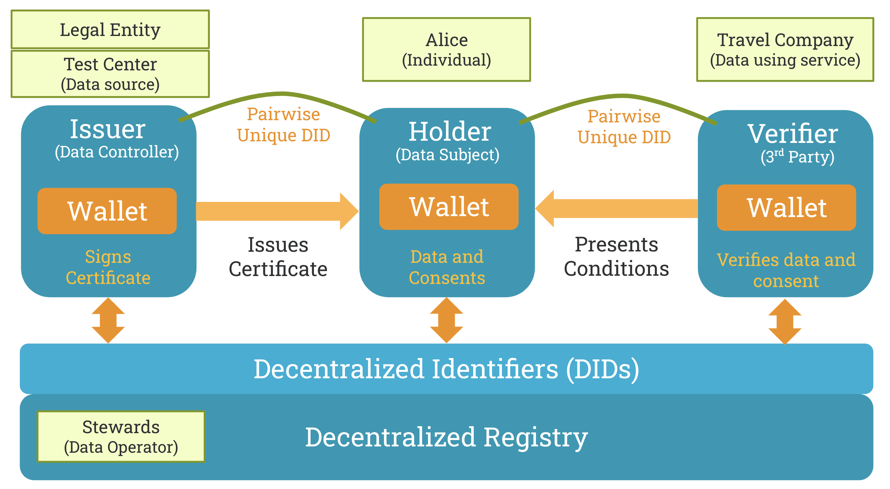

# Information sharing agreement and consents in SSI 

## Table Of Contents
- [Introduction](#introduction)
- [Active and passive data sharing](#active-and-passive-data-sharing)
- [GDPR consent handling](#gdpr-consent-handling)
  * [When is consent appropriate?](#when-is-consent-appropriate)
  * [What is valid consent?](#what-is-valid-consent)
  * [How should we obtain, record and manage consent?](#how-should-we-obtain--record-and-manage-consent)
  * [What are data subject rights?](#what-are-data-subject-rights)
- [Reference case](#reference-case)
- [Consent scenarios](#consent-scenarios)
- [References](#references)

## Introduction

This document introduces consent handling during an active data exchange using data wallets. In this paper, we have assumed the use of Hyperledger Indy as the DLT and Hyperledger-aries cloud and mobile agents as part of this **Decentralised DataExchange project**.

This document is a **discussion paper** written to align technical and legal views in the use of consents and agreements during a data exchange scenario. 

The target of this work is to build a software distribution connecting a data operator service providing consented data exchange to SSI data exchange mechanisms, converting any application to a **Trusted Digital Agent (TDA)**.

## Active and passive data sharing
Active data exchange here means an individual is involved in the process during transfer of data, for example via use of data wallets. Passive data exchange means information is shared from one entity (an org, a machine) to another entity without the individual actively involved in that data exchange.

In both cases, consents can be provided actively at any point to an organisation. 

## GDPR consent handling

As per GDPR [Regulation (EU) 2016/679, Ref [1]], processing personal data is generally prohibited, unless it is expressly allowed by law, or the data subject has consented to the processing. While being one of the more well-known legal bases for processing personal data, consent is only one of six bases mentioned in the General Data Protection Regulation (GDPR). The others are: contract, legal obligations, vital interests of the data subject, public interest and legitimate interest as stated in Article 6(1) GDPR [1].

Consent is one lawful basis for processing, and explicit consent can also legitimise use of special category data. Consent may also be relevant where the individual has exercised their right to restriction, and explicit consent can legitimise automated decision-making and overseas transfers of data.

Genuine consent should put individuals in control, build trust and engagement, and enhance the reputation of the organisation and hence is a valid mechanism to adopt with right tooling in place. Relying on inappropriate or invalid consent could destroy trust and harm your reputation – and may leave you open to large fines.

### When is consent appropriate?
Consent is one of the lawful basis for processing and is not inherently better or more important than these alternatives. It is appropriate if you can offer people real choice and control over how you use their data, and want to build their trust and engagement. 

NOTE: Regardless of whether an organisation uses consent or not, the data exchange need to reply on agreements. These agreement handling could be handled by enabling proper transparency mechanism during an active data sharing and exchange. 

### What is valid consent?

A consent [2, 3]:
> 1. Must be freely given; this means giving people genuine ongoing choice and control over how you use their data
> 2. Should be obvious and require a positive action to opt in. Consent requests must be prominent, unbundled from other terms and conditions, concise and easy to understand, and user-friendly.
> 3. Must specifically cover the controller’s name, the purposes of the processing and the types of processing activity.

Explicit consent must be expressly confirmed in words, rather than by any other positive action. There is no set time limit for consent. How long it lasts will depend on the context. You should review and refresh consent as appropriate.

### How should we obtain, record and manage consent?
Make your consent request prominent, concise, separate from other terms and conditions, and easy to understand. Include:

> - The name of your organisation
> - The name of any third party controllers who will rely on the consent
> - Why you want the data
> - What you will do with it; and
> - that individuals can withdraw consent at any time.

While recording consents, following points are to be noted:

> - You must ask people to actively opt in. Don’t use pre-ticked boxes, opt-out boxes or other default settings. Wherever possible, give separate (‘granular’) options to consent to different purposes and different types of processing
> - Keep records to evidence consent – who consented, when, how, and what they were told
> - Make it easy for people to withdraw consent at any time they choose. Consider using preference-management tools
> - Keep consents under review and refresh them if anything changes. Build regular consent reviews into your business processes.

### What are data subject rights?

<table>
  <tr>
   <td><strong>Rights</strong>
   </td>
   <td><strong>Description</strong>
   </td>
   <td><strong>How applied to SSI</strong>
   </td>
  </tr>
  <tr>
   <td>rectification
   </td>
   <td>Right to have any information collected to be rectified.
   </td>
   <td>The privacy agreement captures the rights. If required a new verifiable credential is created if needed and the old one is revoked.
   </td>
  </tr>
  <tr>
   <td>access
   </td>
   <td>Right to access the data that was collected.
   </td>
   <td>The privacy agreement captures the rights.
   </td>
  </tr>
  <tr>
   <td>portability
   </td>
   <td>Right to take the collected data and use as one chooses for example move data to another service provider
   </td>
   <td>The privacy agreement captures the rights.
   </td>
  </tr>
  <tr>
   <td>forget
   </td>
   <td>Right to have the collected data erased
   </td>
   <td>The privacy agreement captures the rights. If erasure affects sharing data with 3rd parties the erasure is propagated to those 3rd parties.
   </td>
  </tr>
  <tr>
   <td>objection
   </td>
   <td>Right to object to the usage of the collected data
   </td>
   <td>If required a new verifiable credential is created if needed and the old one is revoked.
   </td>
  </tr>
</table>

In addition to the individual rights, these GDPR regulations are fulfilled: 

<table>
  <tr>
   <td><strong>Regulation</strong>
   </td>
   <td><strong>Description</strong>
   </td>
   <td><strong>How applied to SSI</strong>
   </td>
  </tr>
  <tr>
   <td>expiration
   </td>
   <td>Initial consent is tied to a service. When the service period expires then restricted conditions of access to the data apply.
   </td>
   <td>The private data that may have been collected are stopped when service expires. The conditions of access are traceable through proof requests.
   </td>
  </tr>
  <tr>
   <td>limitation
   </td>
   <td>All personal data that is collected shall not be kept longer than is reasonable.
   </td>
   <td>The private data needs to be purged after set limitation.

The conditions of access are traceable through proof requests.
   </td>
  </tr>
</table>

## Reference case
In our reference implementation, we have the individual (Alice) holding her health data in her wallet app issued by a health test center. This health data could be used by Alice to prove her health status to a travel company. The legal entity ensures that the test center follows the schema and governance. 

In this solution we use a hyperledger indy based decentralised ledger, available at https://indy.igrant.io/. More details are provided in the second delivery (eSSIF-Lab: Trusted Digital Assistant -  Contributions to eSSIFLab and SSI). The actors, their roles are also covered in that deliverable.

## Consent scenarios
The various consent or agreement scenarios during an active data exchange for the reference case is given below. Attempts are made to align the terminologies as per MyData Operator (Ref. [6]).

| Individual usage scenario  | Data Source |  Consent  | Data Using Service | Why consent or agreement | 
| ------------- | ------------- | ---------- | ------------- | ------------- | 
| Covid-19 test result data added to the wallet  | Test Center  | No | Data4Life | Here, the reason for transactions is driven by the individual towards data portability.   What is needed is a data exchange receipt for exchange of data from Test Center to Data4Life.| 
| Data in the wallet is used for certain purpose, example during travel   | Test Center | Yes | Data4Life | Data4Life is the processor of the data and needs to hold a receipt of the agreement that has been signed with the Test Center. | 
| Travel Company, need to verify if the individual is recently be tested and if the test is negative   | Data4Life | Yes | Travel Company | Travel company needs certain data for the purpose of ensuring the individual who is travelling is not covid-19 negative.   Here, they could use consent or any other mechanisms. A sharing agreement is signed during the transaction. | 
 
## References
1. Data protection in the EU and Regulation (EU) 2016/679: Available at: [https://ec.europa.eu/info/law/law-topic/data-protection/data-protection-eu_en](https://ec.europa.eu/info/law/law-topic/data-protection/data-protection-eu_en)
2. GDPR reference: [https://gdpr-info.eu/](https://ec.europa.eu/info/law/law-topic/data-protection/data-protection-eu_en)
3. Consent as per GDPR: [https://gdpr-info.eu/issues/consent/](https://ec.europa.eu/info/law/law-topic/data-protection/data-protection-eu_en)
5. Aries 0167 Consent Lifecycle, Available at : [https://github.com/hyperledger/](https://ec.europa.eu/info/law/law-topic/data-protection/data-protection-eu_en)aries-rfcs/tree/master/concepts/0167-data-consent-lifecycle
6. iGrant.io Data Operator developer APIs: [https://developer.igrant.io/](https://developer.igrant.io/) 
7. Understanding MyData Operator, [whitepaper publised 29-April-2020](https://mydata.org/wp-content/uploads/sites/5/2020/04/Understanding-Mydata-Operators-pages.pdf)
7. Data4Life open source assets: [https://github.com/Data4Life-Initiative](https://ec.europa.eu/info/law/law-topic/data-protection/data-protection-eu_en)
8. eSSIF-Lab open source assets created: [https://github.com/decentralised-dataexchange](https://ec.europa.eu/info/law/law-topic/data-protection/data-protection-eu_en)
